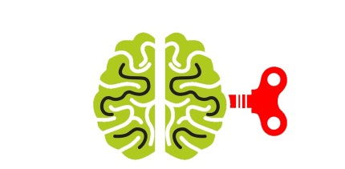

#Проект Brain Games

В рамках проекта необходимо реализовать набор мини-игр, запускаемых из консоли. Эти игры похожи на то, что обычно называют "Brain Games".

Пример игры:

> Welcome to the Brain Game!
> What number is missing in this progression?
>
> May I have your name? John
> Hello, John!
>
> Question: 14 .. 18 20 22 24 26 28
> Your answer: 16
> Correct!
> Question: 5 6 7 8 9 .. 11 12
> Your answer: 10
> Correct!
> Question: 12 15 18 21 .. 27 30 33
> Your answer: 24
> Correct!
> Congratulations, John!
